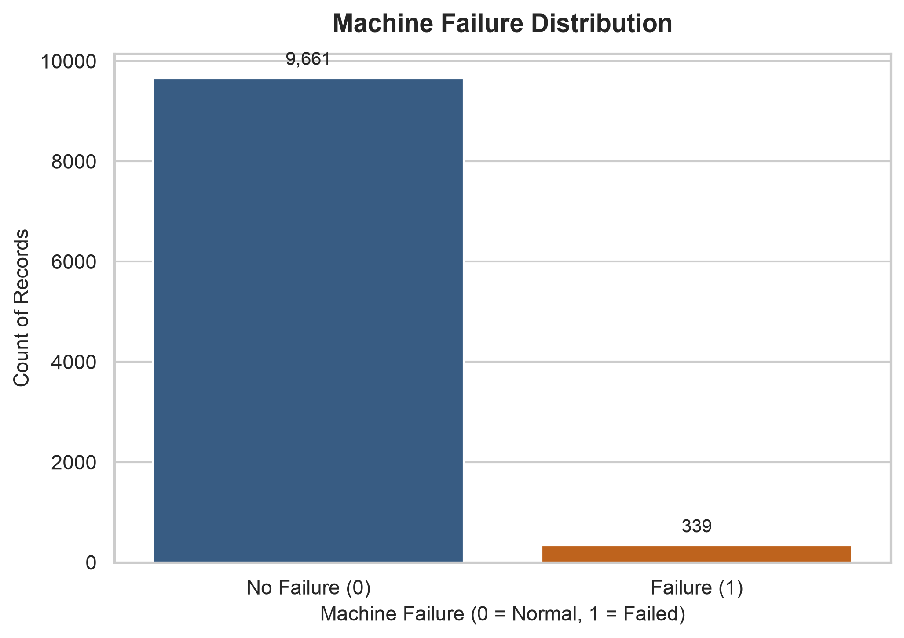
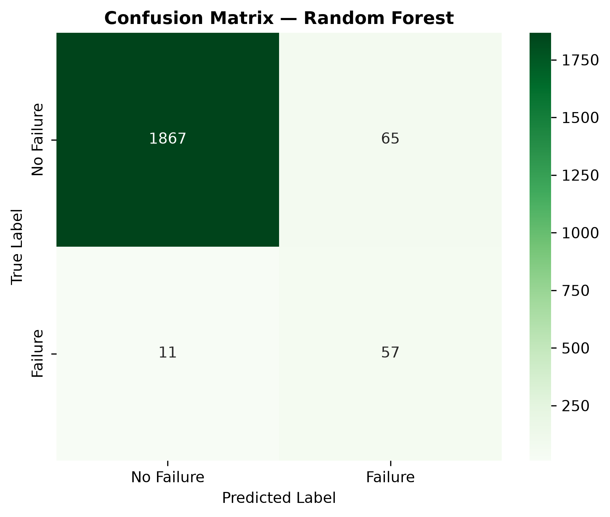
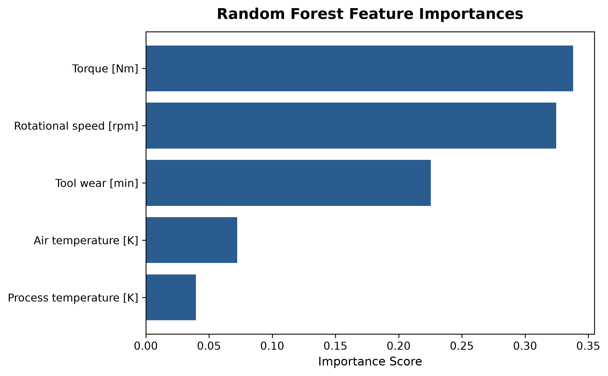

<p align="center">
  
</p>

<h1 align="center">
🔍 IronSight AI
</h1>

<h3 align="center">
Predictive Maintenance Intelligence Platform
</h3>

<p align="center">
End-to-end machine learning project that predicts industrial machine failures from real-time sensor data.
</p>

<br/>


---

# 🌟 Overview

IronSight AI is an end-to-end machine learning system that predicts industrial machine failures from real-time sensor data. The project progresses through three phases: exploratory data analysis, baseline logistic regression modeling, and production-ready Random Forest classification with optimized threshold selection.

The system analyzes five key sensor features — air temperature, process temperature, rotational speed, torque, and tool wear — to predict machine failure events with high recall and precision.

---

# 🚀 Live Demo

Frontend:

🔗 https://ironsight-ai.vercel.app

Backend API:

🔗 https://ironsight-ai.onrender.com/docs

> ⚠️ Backend is deployed on Render Free Tier.
>
> Free instances automatically sleep after inactivity.
> The first request may take around 30-60 seconds while the server wakes up.

---

# 🛠️ Tech Stack

### Backend

| Technology | Purpose |
|---|---|
| Python 3.14 | Runtime |
| FastAPI | REST API |
| Scikit-learn | Machine Learning |
| Pandas | Data Processing |
| NumPy | Numerical Computing |
| Joblib | Model Serialization |

### Frontend

| Technology | Purpose |
|---|---|
| Next.js 16 | React Framework |
| React 19 | UI Components |
| TypeScript | Type Safety |
| Tailwind CSS | Styling |

### AI / Machine Learning

| Technology | Purpose |
|---|---|
| Logistic Regression | Baseline Classification |
| Random Forest | Production Classification |
| Stratified CV | Threshold Selection |
| Class Balancing | Imbalanced Data Handling |

### Deployment

| Platform | Usage |
|---|---|
| Vercel | Frontend Hosting |
| Render | Backend Hosting |

---

# 🧠 ML Pipeline

IronSight AI follows a rigorous 3-phase machine learning pipeline:

### Phase 1 — Exploratory Data Analysis

- Dataset summary statistics
- Failure class imbalance analysis
- Sensor feature distributions (tool wear, torque)
- Feature correlation heatmap

### Phase 2 — Baseline Model

- Logistic Regression with balanced class weights
- Confusion matrix evaluation
- Classification report generation

### Phase 3 — Production Model

- Random Forest classifier with CV-based threshold selection
- 7-step model selection rule:
  1. Stratified 80/20 train-test split (`random_state=42`)
  2. 5-Fold Stratified CV on training data
  3. Evaluate candidate thresholds (`0.30`, `0.40`, `0.50`, `0.60`)
  4. Filter candidates to enforce **CV Recall ≥ 0.80**
  5. Select candidate with highest CV F1-Score (tie-breaker: higher CV Precision)
  6. Retrain winning configuration on full 8,000-row training set
  7. Evaluate locked model and threshold **exactly once** on 2,000-row test set

---

# ✨ Key Features

### 📊 Sensor Data Analysis

- Real-time ingestion of industrial sensor telemetry
- Five key features: temperature, rotational speed, torque, tool wear
- Feature correlation and distribution analysis

### 🎯 Predictive Modeling

- Binary classification: Failure / No Failure
- Optimized threshold selection via stratified cross-validation
- Class imbalance handling with balanced weights

### 📈 Model Evaluation

- Confusion matrix visualization
- Precision, recall, and F1-score reporting
- Baseline vs. production model comparison

### 🔧 Deployment Ready

- FastAPI backend with Uvicorn server
- Next.js frontend with TypeScript
- Environment-based configuration

---

# 🏗️ System Architecture

```
┌─────────────────────────────────────────────────────────────┐
│                    NEXT.JS FRONTEND                         │
│                        (Vercel)                             │
│                                                             │
│   Sensor Input Form ──► Prediction Display ──► History      │
└──────────────────────────┬──────────────────────────────────┘
                           │ REST API
                           ▼
┌─────────────────────────────────────────────────────────────┐
│                   FASTAPI BACKEND                           │
│                      (Render)                               │
│                                                             │
│   1. Input Validation (Pydantic)                            │
│   2. Feature Preprocessing (NumPy)                          │
│   3. Model Inference (Scikit-learn RF)                      │
│   4. Decision Logic (Threshold → Binary)                    │
│   5. Response Serialization                                 │
└──────────────────────────┬──────────────────────────────────┘
                           │
                           ▼
┌─────────────────────────────────────────────────────────────┐
│                    MODEL ARTIFACT                           │
│                    rf_model.pkl                             │
│                                                             │
│   Pipeline    : RandomForestClassifier                      │
│   Threshold   : Optimized CV-based cutoff                   │
│   Features    : 5 sensor measurements                       │
└─────────────────────────────────────────────────────────────┘
```

---

# 📂 Project Structure

```
ironsight-ai/
├── data/
│   └── ai4i2020.csv                      # Source dataset (read-only)
├── models/
│   ├── baseline_model.pkl                 # Logistic Regression artifact
│   └── rf_model.pkl                       # Random Forest + threshold
├── outputs/
│   ├── failure_distribution.png           # Failure class imbalance
│   ├── tool_wear_vs_failure.png           # Tool wear comparison
│   ├── torque_vs_failure.png              # Torque comparison
│   ├── sensor_correlation_heatmap.png     # Feature correlations
│   ├── confusion_matrix.png              # Baseline confusion matrix
│   ├── rf_feature_importance.png         # RF feature importances
│   ├── rf_threshold_comparison.png       # CV metrics across thresholds
│   └── rf_confusion_matrix.png           # RF test confusion matrix
├── src/
│   ├── train.py                           # Baseline training script
│   └── train_rf.py                        # RF + threshold tuning
├── backend/
│   ├── app/
│   │   ├── main.py                        # FastAPI application
│   │   ├── predictor.py                   # Model inference
│   │   ├── validator.py                   # Input validation
│   │   ├── decision.py                    # Threshold logic
│   │   └── schemas.py                     # Pydantic models
│   └── requirements.txt                   # Backend dependencies
├── frontend/
│   └── src/                               # Next.js application
├── analysis.py                            # EDA script (Phase 1)
├── requirements.txt                       # ML dependencies
└── README.md
```

---

# ⚙️ Local Development

### Prerequisites

- Python 3.10+
- Node.js 18+ & npm/pnpm

---

## Backend Setup

```bash
# Create virtual environment
python3 -m venv .venv
source .venv/bin/activate    # On Windows: .venv\Scripts\activate

# Install ML dependencies
pip install -r requirements.txt

# Install backend dependencies
pip install -r backend/requirements.txt
```

### Run Phase 1 — EDA

```bash
python analysis.py
```

### Run Phase 2 — Baseline Model

```bash
python src/train.py
```

### Run Phase 3 — Production Model

```bash
python src/train_rf.py
```

### Run Backend API

```bash
uvicorn backend.app.main:app --reload --port 8000
```

Backend runs on:

```
http://localhost:8000
```

API docs: `http://localhost:8000/docs`

---

## Frontend Setup

```bash
cd frontend
pnpm install
pnpm run dev
```

Frontend runs on:

```
http://localhost:3000
```

---

## Environment Variables

### Backend (Render)

```bash
CORS_ORIGINS=https://your-vercel-app.vercel.app
```

Optional:

```bash
PYTHON_VERSION=3.14.3
```

### Frontend (Vercel)

```bash
NEXT_PUBLIC_API_BASE_URL=https://your-render-service.onrender.com
```

---

# 📡 API Documentation

### `POST /predict`

Submit sensor readings and receive a failure prediction.

**Content-Type**: `application/json`

**Request Body**:

| Field | Type | Description |
|---|---|---|
| `air_temperature` | Float | Air temperature in Kelvin |
| `process_temperature` | Float | Process temperature in Kelvin |
| `rotational_speed` | Float | Rotational speed in RPM |
| `torque` | Float | Torque in Nm |
| `tool_wear` | Float | Tool wear in minutes |

**Response**:

```json
{
  "prediction": 0,
  "probability": 0.12,
  "threshold": 0.45,
  "risk_level": "Low"
}
```

---

# 📊 Model Artifacts

### `models/rf_model.pkl`

| Key | Description |
|---|---|
| `pipeline` | Scikit-learn Pipeline (RandomForestClassifier) |
| `threshold` | Optimal probability decision threshold |
| `feature_names` | List of 5 input feature column names |
| `feature_units` | Dict of feature units (K, rpm, Nm, min) |
| `feature_ranges` | Min, max, and unit for each feature |
| `target_name` | Prediction target column name |

---

# 📸 Screenshots

<p align="center">

</p>

<p align="center">

</p>

<p align="center">

</p>

---

# 🔮 Roadmap

- [ ] Real-time streaming sensor data integration
- [ ] Multi-machine fleet monitoring dashboard
- [ ] Time-series anomaly detection models
- [ ] Automated retraining pipeline
- [ ] Cloud-native deployment (AWS/GCP)
- [ ] REST API versioning and authentication

---

# 🤝 Contributing

Contributions are welcome.

```bash
git checkout -b feature-name
git add .
git commit -m "Added feature"
git push origin feature-name
```

Create a Pull Request 🚀

---

# 📄 License

This project is licensed under the MIT License.

---

# Built With ❤️

Built by developers who believe predictive maintenance should be intelligent, accessible, and production-ready.
